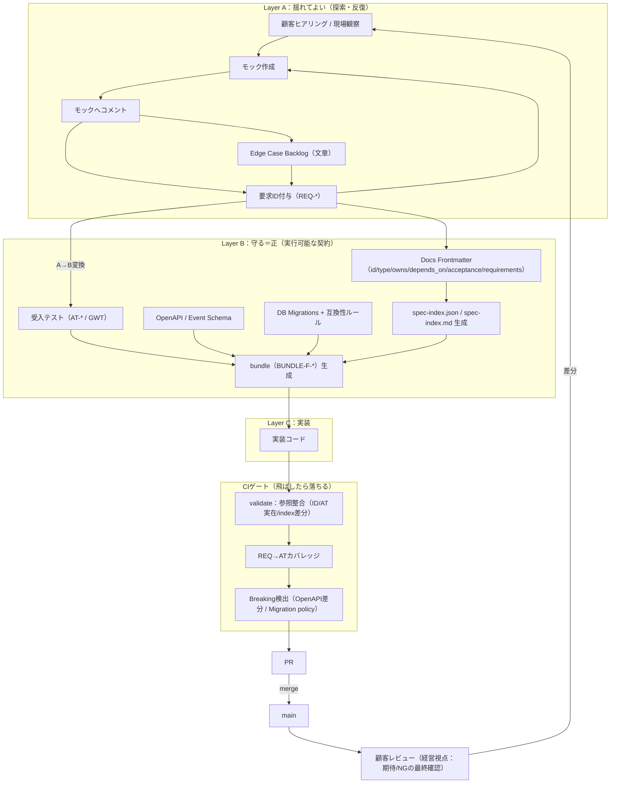
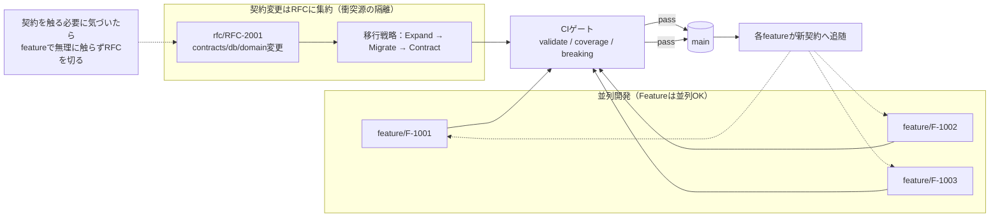
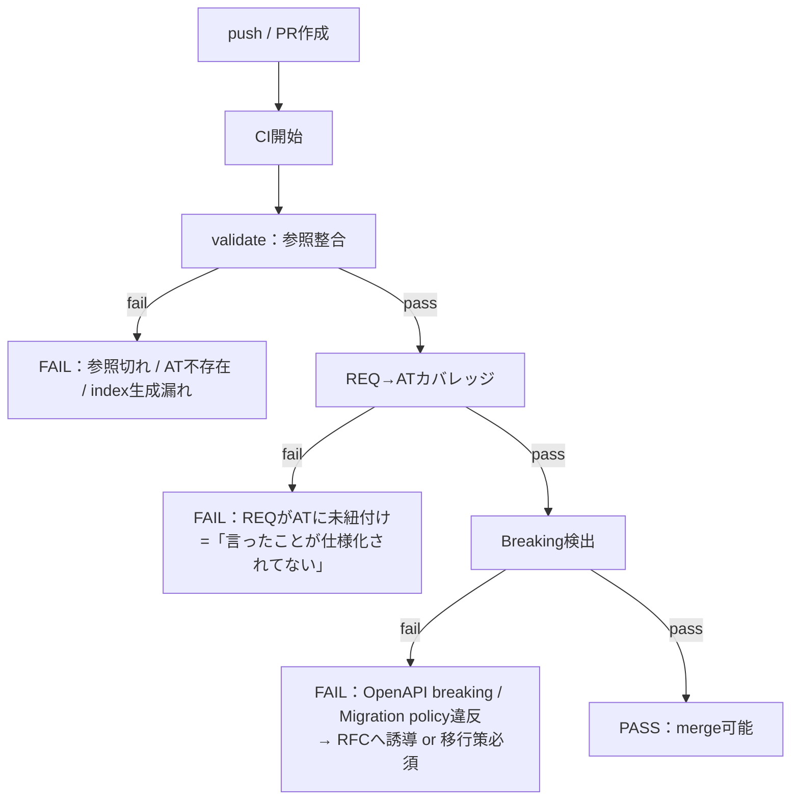

# SDD議論 統合メモ（作業用）

## 目的

* これまでの議論を一元化し、仕様駆動開発（SDD）の実運用に耐える形に整理する
* Claude Code / Skills / agent.md 等への落とし込み前提で、抜け漏れを防ぐ

## 前提・憲法（合意事項）

* Spec-first / Test-first
* 推測実装・暗黙知の禁止
* レイヤー間トレーサビリティ（経営→要件→テスト）

## レイヤー整理（統合版：仕様駆動×アジャイル×AI並列）

### 重要：レイヤーは「情報の安定度」と「正の仕様（Source of truth）」で分ける

* Layer A：揺れてよい（探索・発見・反復）
* Layer B：守る＝正（機械が守る契約・実行可能）
* Layer C：実装（コード）

> 以前の整理（A/B/C/D）で言うと、**D（テスト）を B に統合**した形。
> 「正の仕様＝実行可能なもの（テスト/契約/マイグレーション）」を最優先にする。

### Layer A（揺れてよい）

* 業務文章（困りごと・期待結果）
* モックへのコメント
* エッジケースの気づき（Backlog）
* 要求ID（REQ-*）

### Layer B（守る＝正 / Source of truth）

* 受け入れ基準テスト（AT-* / Given-When-Then）
* OpenAPI / event schema
* DB migrations（＋互換性ルール）

#### Layer B は「ズラーっとテストが並ぶ」？（答え：並ぶが、無限に増やさない）

* 原則：**REQ は必ず 1本以上のATに紐づく**（REQ→ATカバレッジ）
* ただし：**REQ=AT 1対1に固定しない**（1つのATが複数REQをカバーしてOK）
* ケース爆発は「Edge Case Backlog → ディシジョンテーブル化」で段階的に成熟させる

#### Layer B の中身（具体像）

1. **AT（受入テスト）**

* UIモック段階：Playwright等で「遷移/表示/入力制約」のスモーク保証
* 本実装段階：同じATを本番経路で流し回帰テストにする
* AT には機械検出できる形で REQ-* を紐付ける（frontmatter or テストメタ）

2. **API契約（OpenAPI）**

* OpenAPI は “正” の契約として差分比較し、breaking をCIで落とす
* いわゆる APIテスト（APIT）が必要なら、次の2つを分ける

  * **契約テスト**：OpenAPI準拠（schema/型/必須など）を検証
  * **挙動テスト**：代表ケースで endpoint の振る舞いを検証（必要最小限）

3. **DB契約（migrations + policy）**

* migration は “正” の履歴であり、破壊的変更（削除/型変更/必須化など）を方針で縛る
* 破壊が必要なら RFC + 移行戦略（Expand→Migrate→Contract）

4. **マスタ（master）の扱い**

* master は「参照整合や業務ルールの前提」になりやすいので、Layer B に寄せて扱うと事故りにくい

  * **スキーマ/制約**：migration（テーブル・制約）
  * **データの前提**：seed/fixture（必要なら）
  * **不変条件**：domain/rule-sets への依存として frontmatter の depends_on に載せる
* master の変更が複数機能に影響するなら、cross-cutting と見なして **RFC扱い**に寄せる

#### 典型的なディレクトリ像（例）

* contracts/

  * openapi/*.yaml
  * events/*.schema.json
* db/

  * migrations/*
  * seeds/master/*（必要な場合のみ）
* tests/

  * acceptance/*（AT：Playwright/Cucumber/pytestなど）
  * api-contract/*（OpenAPI準拠/スキーマ検証など）

### Layer C（実装）

* コード

## ワークフロー設計（CLI前提・統合版）

### フロー図（Mermaid）

#### 1) 全体フロー（ヒアリング→REQ→AT/契約→実装→CI→顧客レビュー）

#### 2) 並列開発（Feature並列 + 契約変更はRFCに隔離）

#### 3) CIゲート詳細（何をチェックして落とすか）

### 補足：モックと本番／厳密な順番／テスト作成タイミング

#### 1) モックと本番の違い（この議論での定義）

* **モック**：要件探索のための“体験の仮説”。目的は *学習*（コメント回収→REQ更新）。

  * 実装形態は何でもよい：Figma/Storybook/スタブAPI/簡易実装/ステージング上のFeature Flag など
  * 重要なのは「フィードバックが Layer A（REQ/コメント/Edge）に戻る」こと

* **本番**：契約（Layer B）を守り、互換性を壊さずに提供するもの。

  * OpenAPI / DB / 共通ルールの破壊的変更は **RFC + 移行策（Expand→Migrate→Contract）** が前提

#### 2) 「ある程度実装して触って帰る」場合もモックを作る？

* **作る（= その触れるものを “モック扱い” にする）** のが安全。
* ただし「別物のモックを必ず作る」のではなく、次の形が現実的：

  * **ステージング + Feature Flag** で“触れるモック”を提供（本番には出さない）
  * フィードバックは **コメント→REQ更新（Layer A）** へ回収
  * その差分を **AT/OpenAPI/Migration（Layer B）** に反映してから merge

#### 3) 並列でも崩れない“厳密な順番”（ゲート）

* **G0：Issue整備**（Scope/Owned/Non-goals/DoD、REQ候補）
* **G1：Layer A更新**（REQ-*確定、モック/コメント/Edge反映）
* **G2：Layer B作成**（AT-*作成、必要ならOpenAPI/Migration案、frontmatter整備→index/bundle生成）
* **G3：契約変更の有無判定**

  * 変更あり → **RFC Issue + rfcブランチ** に分離（featureで契約を触らない）
  * 変更なし → 次へ
* **G4：実装（Layer C）**
* **G5：CIゲート通過**（validate → REQ→ATカバレッジ → breaking）
* **G6：merge / 顧客レビュー / 学習をLayer Aへ戻す**

> 並列化できるのは G0〜G2 と G4（契約を触らない範囲）。
> **契約（contracts/db/domain）の変更だけは RFC で主導権を集約**して、実質“直列化”する。

#### 4) テストはどこで作られる？

* **受入テスト（AT-*）**：原則 **G2（A→B変換）で作る**（実装前に作って“赤”でもOK）。
* 実装中に見つかった差分は Layer A に戻して REQ を更新し、AT を更新する（反復）。
* **ユニット/統合テスト**：G4で実装と並行して増えるが、merge条件は「AT/CIを満たす」。

#### 5) 簡易実装モック（Next.js単体）運用：どう位置づける？

あなたが言う「簡易実装（Next.jsで見た目だけ触れる）」は、このワークフロー上では **“モックの一形態”** として扱うのが最適。

**目的（モックとしてのNext.js）**

* UI/画面遷移/入力体験を早く見せて、コメントを回収して **REQを育てる**
* まだ契約（OpenAPI/DB）を確定させない（＝**偽の約束を作らない**）

**推奨実装パターン（バックエンド無しでも崩れない）**

* データはローカル（fixture JSON）で持つ
* APIが必要に見える箇所は **MSW等でスタブ**（後で実APIに差し替え）
* 画面は Feature Flag で隔離して main に置けるようにする（共有・デモが楽）

**テスト（AT）の作り方：モック段階で何を保証する？**

* モック段階の AT は「画面体験のGiven-When-Then」を **Playwright 等のE2Eでスモーク保証**するのが現実的

  * 例："Given ログイン済み When 申請フォームに入力して送信 Then 確認画面に遷移しサマリが表示される"
* まだビジネス計算やDB整合が無いなら、ATは **遷移/表示/入力制約**に寄せる
* 後で本実装（API/DB）が入ったら、同じATを本番経路に流して回帰テストにする

**厳密な順番（モックが絡む場合の最短ルート）**

* 先に「触れるもの」を出したいときは、次の“二段ロケット”が安全：

  1. **モックPR（UIだけ）**：REQを仮で立てる → 触ってコメント回収 → REQ更新
  2. **本PR（A→B確定→実装）**：REQ確定 → AT作成 → 必要ならRFC → 実装 → CI

> コツ：モックPRを main に入れるなら **Feature Flag + 最低限のAT（スモーク）** をセットにする。
> 逆に、AT無し・参照無しのモックを main に入れると、後で「何のためのUIか」が消えて負債化しやすい。

### 0. ゴール

* 要件は最初から出し切れない前提で、反復（モック→コメント→更新）しながら育てる
* ただし DB/API/共通ルールの変更で破綻しない（他機能を壊さない）
* 開発者の手を最小化し、AIが並列で進めても崩れない

**核心**：仕様書を“管理”するのではなく、要件を「機械が守る契約」へ変換し続けるパイプラインを作る

---

### 1. 原則（ブレない前提）

1. **要件は揺れてよい、契約は保守的**

* 画面・フロー・文章要件は反復で変わってOK
* ただし contracts / db / domain は雑に変えない

2. **“正の仕様”は文章ではなく実行可能なもの**

* 正（Source of truth）：受入テスト / OpenAPI・event schema / DB migrations
* Markdown：補助（意図・背景・説明）

3. **壊したらマージできない（強制）**

* 手順書ではなく CI/検証で順序を担保する（飛ばしたら落ちる）

---

### 2. 仕様を3層に分ける（情報設計）

* Layer A（揺れてよい）→ Layer B（守る＝正）→ Layer C（実装）

---

### 3. Layer A → B が最重要（価値がここで決まる）

* 経営者が言ったこと（A）がテスト（B）に落ちていないと「言ったのに反映されてない」で終了
* **REQ → AT（Acceptance Test）** のトレーサビリティを作り、未達はCIでfail

**REQ運用（例）**

* REQ-2026-0012 のように要望へID付与
* 受け入れテストへ紐付け（タグ/メタデータ/記述形式は自由だが、機械的に検出できること）

---

### 4. ドキュメント分割の参照漏れ対策（frontmatter＋index＋bundle）

ドキュメントが増えるほど参照漏れが起きるため、タグだけではなく構造化メタデータを必須化する。

#### 4.1 全ドキュメント共通の frontmatter（YAML）

必須要素：

* id / type
* owns（この仕様が責任を持つ契約：API/テーブル/イベント等）
* depends_on（参照している前提：ruleset/glossary等）
* acceptance（AT-*）
* （必要なら requirements（REQ-*））

#### 4.2 index 生成

* 全frontmatterを集計し **spec-index.json**（ID→ファイル→参照関係）を生成
* 人間向けに **spec-index.md** も生成

#### 4.3 bundle（コンテキスト束ね）

* bundle（例：BUNDLE-F-XXXX）で関連ドキュメント・契約・テストを1つに束ねる
* 実装計画・タスク分解・AI入力を bundle に統一し、参照漏れを減らす

---

### 5. エッジケース運用（機能紐づきが基本＋共通のみ昇格）

#### 5.1 基本

* エッジケースは原則 feature に紐づく
* 複数機能に刺さるものは cross-cutting / rule-sets へ昇格

#### 5.2 段階的成熟モデル

* Level 0：基本ケースだけ
* Level 1：Edge Case Backlog（文章で蓄積）
* Level 2：爆発する領域だけディシジョンテーブル化

  * テーブル1行＝受け入れテスト1本が理想

---

### 6. CIゲート（“守るべき順序”を強制する）

#### 6.1 参照整合（validate）

* frontmatter参照切れ（ID不存在）
* acceptance（AT-*）の実在チェック
* index生成の差分チェック（生成し忘れ防止）

#### 6.2 REQ→ATカバレッジ

* REQが受け入れテストに紐づいていない場合はfail
* 「言ったことが仕様化されていない」をマージ前に検知

#### 6.3 破壊的変更の検出

* OpenAPI breaking change 検出（削除/型変更/必須化など）
* migration policy（削除・型変更など禁止 or RFC必須）

---

### 7. 並列開発（Issue / ブランチ / worktree）

#### 7.1 並列化の単位

* Feature（F-*）は多数並列OK
* 契約（contracts/db/domain）は衝突源なのでルールで分離

#### 7.2 Issueは“実行指示書”

Issue必須：

* Scope（対象ID）
* Owned（触っていい契約・ファイル範囲）
* Acceptance（AT-*）
* Requirements（REQ-*）
* Non-goals（触らない領域）
* DoD（CIが通る／validateが通る）

#### 7.3 ブランチ＆worktree

* 1 Issue = 1 branch
* 1 Issue = 1 worktree
* 1 worktree = 1 PR（混ぜない）

---

### 8. RFC運用（契約変更の集約）

**ルール：contracts / db / domain に触るなら全部RFC**

#### 8.1 RFCを切る条件（強制）

* /contracts/** を変更
* /db/migrations/** を追加/変更
* /specs/domain/**（glossary/invariants）を変更
* 共通ルール（cross-cutting / rule-sets）を変更
  → 必ず RFC Issue + rfcブランチ

#### 8.2 途中でRFCに気づいたときの定石

* feature側で無理に契約を触らない
* RFCを切って契約変更を集約（編集権をRFC側へ）
* RFCで 契約→テスト→移行策 を先に固め main へ
* featureが順次追随

#### 8.3 Breaking変更の移行戦略（推奨）

* Expand → Migrate → Contract

  * Expand：新要素追加（旧は残す）
  * Migrate：利用を移す
  * Contract：最後に旧を削除

---

### 9. “手順書だけでは順序化されない”への答え

* skills / agent.md：方針・判断基準・テンプレを示す「憲法」
* 順序保証：**実行可能なゲート（validate/CI）** で行う
* つまり「飛ばしたら落ちる」までコード化して初めてワークフローが成立する

---

### 10. 最小で作るべき骨格（推奨順）

1. frontmatterスキーマ決定
2. index生成
3. bundle生成
4. validate（参照整合）
5. REQ→ATカバレッジ検証
6. OpenAPI breaking / migration policy 検証
7. RFC/Issue/ブランチ/worktree規約の明文化（運用固定）

## ツール配置方針（叩き台）

* **skills / agent.md**：憲法（判断基準・テンプレ・NG集・レビュー観点）
* **CLI（scripts）**：index/bundle/validate/coverage/breaking-check を実行可能にする
* **GitHub**：Issue=実行指示書、PR=証跡（REQ/AT/owns/depends_on を必須に）
* **CI**：validate/coverage/breaking を必須ゲート化（通らないとマージ不可）

## 未決事項・論点（次の議論）

* [ ] REQ/AT/owns/depends_on の“機械検出”フォーマットをどこに固定するか（frontmatterに寄せるか、テスト側メタに寄せるか）
* [ ] bundle の単位（Feature単位固定か、複合bundleを許すか）
* [ ] OpenAPI / DB の breaking 判定の採用ツール（何を正として差分を見るか）
* [ ] RFCのDoD（最低限どこまで揃えば main に入れられるか）

---

※このドキュメントを起点に順次ブラッシュアップする
