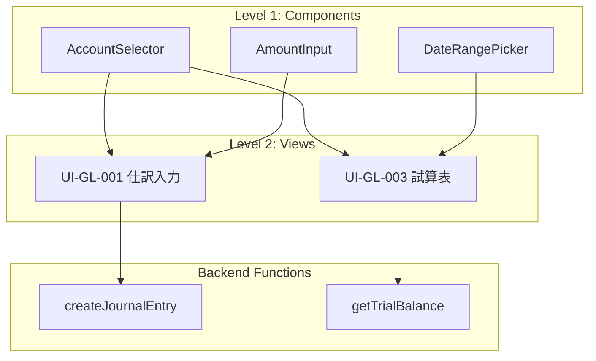

# Frontend Task Structure Proposal

## 背景

現在のThe Meshはバックエンド特化で、タスクは「機能（function）単位」で切られている。フロントエンド対応を検討するにあたり、タスクの粒度をどう設定すべきかを検討する。

## 課題

フロントエンドタスクの区切り方には以下の選択肢がある：

| 区切り方 | メリット | デメリット |
|---------|---------|-----------|
| 機能単位 | バックエンドと一致 | 1機能が複数画面に影響 |
| 画面単位 | ユーザー視点で明確 | 1画面に複数機能が混在 |
| コンポーネント単位 | 再利用性が高い | タスク爆発の可能性 |

## 上流工程ドキュメントからの考察

### RTM（要件トレーサビリティマトリクス）の構造

`上流工程/02_要件定義/07_RTM_要件トレーサビリティ.md` より：

```
要件ID → 画面設計ID → ER設計ID → テストケースID
REQ-GL-001 → UI-GL-001 → ER-GL-001 → TC-GL-001
```

重要な発見：
- 要件（REQ）は機能レベル
- UI設計（UI）は画面レベル
- 1つの画面が複数要件をカバーする場合がある
  - 例: UI-GL-003 は REQ-GL-003 と REQ-GL-004 をカバー

### アーキテクチャ設計からの示唆

`上流工程/03_基本設計/01_アーキテクチャ設計_会計モジュール.md` より：

共通コンポーネント：
- 認証・認可
- 監査ログ
- マスタ管理
- ワークフロー
- 帳票出力

→ これらは画面横断で使用される

## 提案: 3層構造タスク

```
Level 1: Common Components（共通コンポーネント）
    ↓ 依存
Level 2: Views（画面） ← メインタスク単位
    ↓ 構成
Level 3: Routes（ルーティング・ナビゲーション）
```

### Level 1: Common Components

画面横断で使用される再利用可能コンポーネント。

```yaml
components:
  - id: AccountSelector
    type: input
    props: [accounts, selected, onChange]

  - id: AmountInput
    type: input
    props: [value, currency, onChange]
    validation: positive_number

  - id: DateRangePicker
    type: input
    props: [startDate, endDate, onChange]

  - id: TransactionTable
    type: display
    props: [transactions, columns, onRowClick]
    features: [sorting, filtering, pagination]
```

**タスク粒度**: コンポーネント単位（依存なし、独立開発可能）

### Level 2: Views（メインタスク単位）

RTMのUI-IDに対応する画面単位。

```yaml
views:
  - id: UI-GL-001
    name: 仕訳入力画面
    type: form
    requirements: [REQ-GL-001]  # 要件へのリンク
    components: [AccountSelector, AmountInput, DatePicker]
    functions: [createJournalEntry]  # バックエンド機能へのリンク

  - id: UI-GL-003
    name: 試算表照会画面
    type: list
    requirements: [REQ-GL-003, REQ-GL-004]  # 複数要件
    components: [AccountSelector, DateRangePicker, TransactionTable]
    functions: [getTrialBalance, exportTrialBalance]
```

**タスク粒度**: View単位（これがメインタスク単位）

メリット：
- RTMのUI-IDと1:1対応
- ユーザーストーリーと一致
- テスト（E2E）の単位として適切

### Level 3: Routes

画面間のナビゲーションとルーティング。

```yaml
routes:
  - path: /gl/journal/new
    view: UI-GL-001
    guards: [authenticated, hasRole:accountant]

  - path: /gl/trial-balance
    view: UI-GL-003
    guards: [authenticated]
```

**タスク粒度**: 通常は独立タスクにしない（View実装に含める）

## TRIRスキーマ拡張案

### 現行スキーマ（mesh.schema.json）

```json
{
  "views": {
    "type": "array",
    "items": {
      "properties": {
        "id": { "type": "string" },
        "type": { "enum": ["list", "detail", "form", "dashboard"] },
        "entity": { "type": "string" },
        "fields": { "type": "array" }
      }
    }
  }
}
```

### 拡張案

```json
{
  "views": {
    "items": {
      "properties": {
        "id": { "type": "string" },
        "requirementIds": {
          "type": "array",
          "items": { "type": "string" }
        },
        "components": {
          "type": "array",
          "items": { "$ref": "#/definitions/componentRef" }
        },
        "functions": {
          "type": "array",
          "items": { "type": "string" }
        }
      }
    }
  },
  "components": {
    "type": "array",
    "items": {
      "properties": {
        "id": { "type": "string" },
        "type": { "enum": ["input", "display", "layout", "action"] },
        "props": { "type": "array" },
        "events": { "type": "array" }
      }
    }
  }
}
```

## タスクパッケージ構造

### バックエンド（現行）

```
tasks/
  feature_createJournalEntry/
    TASK.md
    context.json
    tests/
```

### フロントエンド（提案）

```
tasks/
  component_AccountSelector/      # Level 1
    TASK.md
    context.json
    tests/

  view_UI-GL-001/                 # Level 2 (メイン)
    TASK.md
    context.json
    tests/

  view_UI-GL-003/
    TASK.md
    context.json
    tests/
```

## 依存関係



## テスト戦略

| タスクレベル | テストタイプ | 内容 |
|-------------|------------|------|
| Component | Unit Test | Storybook + Jest |
| View | Integration Test | React Testing Library |
| View | E2E Test | Playwright/Cypress |
| Route | E2E Test | Navigation tests |

## 次のステップ

1. [ ] TRIRスキーマへの `components` セクション追加
2. [ ] `views` スキーマの拡張（requirementIds, functions リンク）
3. [ ] フロントエンドタスクパッケージジェネレーター実装
4. [ ] コンポーネントライブラリテンプレート作成
5. [ ] E2Eテストジェネレーター実装

## 参考ドキュメント

- `上流工程/02_要件定義/07_RTM_要件トレーサビリティ.md`
- `上流工程/03_基本設計/01_アーキテクチャ設計_会計モジュール.md`
- `src/the_mesh/generators/task_package_gen.py`
- `src/the_mesh/schemas/mesh.schema.json`
