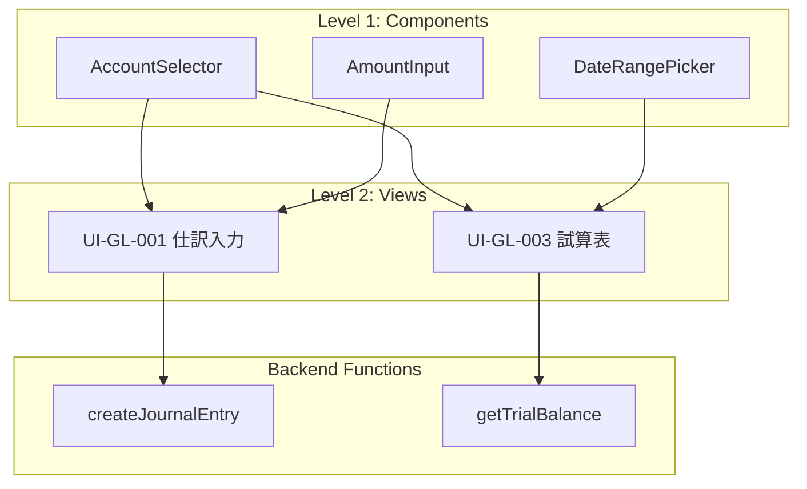

# Frontend Task Structure Proposal

## 背景

現在のThe Meshはバックエンド特化で、タスクは「機能（function）単位」で切られている。フロントエンド対応を検討するにあたり、タスクの粒度をどう設定すべきかを検討する。

## 課題

フロントエンドタスクの区切り方には以下の選択肢がある：

| 区切り方 | メリット | デメリット |
|---------|---------|-----------|
| 機能単位 | バックエンドと一致 | 1機能が複数画面に影響 |
| 画面単位 | ユーザー視点で明確 | 1画面に複数機能が混在 |
| コンポーネント単位 | 再利用性が高い | タスク爆発の可能性 |

## 上流工程ドキュメントからの考察

### RTM（要件トレーサビリティマトリクス）の構造

`上流工程/02_要件定義/07_RTM_要件トレーサビリティ.md` より：

```
要件ID → 画面設計ID → ER設計ID → テストケースID
REQ-GL-001 → UI-GL-001 → ER-GL-001 → TC-GL-001
```

重要な発見：
- 要件（REQ）は機能レベル
- UI設計（UI）は画面レベル
- 1つの画面が複数要件をカバーする場合がある
  - 例: UI-GL-003 は REQ-GL-003 と REQ-GL-004 をカバー

### アーキテクチャ設計からの示唆

`上流工程/03_基本設計/01_アーキテクチャ設計_会計モジュール.md` より：

共通コンポーネント：
- 認証・認可
- 監査ログ
- マスタ管理
- ワークフロー
- 帳票出力

→ これらは画面横断で使用される

## 提案: 3層構造タスク

```
Level 1: Common Components（共通コンポーネント）
    ↓ 依存
Level 2: Views（画面） ← メインタスク単位
    ↓ 構成
Level 3: Routes（ルーティング・ナビゲーション）
```

### Level 1: Common Components

画面横断で使用される再利用可能コンポーネント。

```yaml
components:
  - id: AccountSelector
    type: input
    props: [accounts, selected, onChange]

  - id: AmountInput
    type: input
    props: [value, currency, onChange]
    validation: positive_number

  - id: DateRangePicker
    type: input
    props: [startDate, endDate, onChange]

  - id: TransactionTable
    type: display
    props: [transactions, columns, onRowClick]
    features: [sorting, filtering, pagination]
```

**タスク粒度**: コンポーネント単位（依存なし、独立開発可能）

### Level 2: Views（メインタスク単位）

RTMのUI-IDに対応する画面単位。

```yaml
views:
  - id: UI-GL-001
    name: 仕訳入力画面
    type: form
    requirements: [REQ-GL-001]  # 要件へのリンク
    components: [AccountSelector, AmountInput, DatePicker]
    functions: [createJournalEntry]  # バックエンド機能へのリンク

  - id: UI-GL-003
    name: 試算表照会画面
    type: list
    requirements: [REQ-GL-003, REQ-GL-004]  # 複数要件
    components: [AccountSelector, DateRangePicker, TransactionTable]
    functions: [getTrialBalance, exportTrialBalance]
```

**タスク粒度**: View単位（これがメインタスク単位）

メリット：
- RTMのUI-IDと1:1対応
- ユーザーストーリーと一致
- テスト（E2E）の単位として適切

### Level 3: Routes

画面間のナビゲーションとルーティング。

```yaml
routes:
  - path: /gl/journal/new
    view: UI-GL-001
    guards: [authenticated, hasRole:accountant]

  - path: /gl/trial-balance
    view: UI-GL-003
    guards: [authenticated]
```

**タスク粒度**: 通常は独立タスクにしない（View実装に含める）

## TRIRスキーマ拡張案

### 現行スキーマ（mesh.schema.json）

```json
{
  "views": {
    "type": "array",
    "items": {
      "properties": {
        "id": { "type": "string" },
        "type": { "enum": ["list", "detail", "form", "dashboard"] },
        "entity": { "type": "string" },
        "fields": { "type": "array" }
      }
    }
  }
}
```

### 拡張案

```json
{
  "views": {
    "items": {
      "properties": {
        "id": { "type": "string" },
        "requirementIds": {
          "type": "array",
          "items": { "type": "string" }
        },
        "components": {
          "type": "array",
          "items": { "$ref": "#/definitions/componentRef" }
        },
        "functions": {
          "type": "array",
          "items": { "type": "string" }
        }
      }
    }
  },
  "components": {
    "type": "array",
    "items": {
      "properties": {
        "id": { "type": "string" },
        "type": { "enum": ["input", "display", "layout", "action"] },
        "props": { "type": "array" },
        "events": { "type": "array" }
      }
    }
  }
}
```

## タスクパッケージ構造

### バックエンド（現行）

```
tasks/
  feature_createJournalEntry/
    TASK.md
    context.json
    tests/
```

### フロントエンド（提案）

```
tasks/
  component_AccountSelector/      # Level 1
    TASK.md
    context.json
    tests/

  view_UI-GL-001/                 # Level 2 (メイン)
    TASK.md
    context.json
    tests/

  view_UI-GL-003/
    TASK.md
    context.json
    tests/
```

## 依存関係



## テスト戦略

| タスクレベル | テストタイプ | 内容 |
|-------------|------------|------|
| Component | Unit Test | Storybook + Jest |
| View | Integration Test | React Testing Library |
| View | E2E Test | Playwright/Cypress |
| Route | E2E Test | Navigation tests |

---

## モックベース要件定義ツール構想

フロントエンド対応と合わせて、要件定義プロセス自体をツール化する構想。

### 基本コンセプト

ユーザーシナリオごとにモック（ワイヤーフレーム）の遷移を提示し、視覚的に確認しながら要件を詰めていく。

### UI構成: 左右分割レイアウト

```
┌────────────────────────────────────────────────────────────────────────────────┐
│ 📁 SC-GL-001: 通常仕訳登録                                    [◀ 前] [次 ▶]   │
├────────────────────────────────────────────────────────────────────────────────┤
│                                                                                │
│  ┌─ モック ──────────────────────┐   ┌─ スペック ────────────────────────────┐ │
│  │                               │   │                                       │ │
│  │  ┌─────────────────────────┐  │   │  [フロー] [決定表] [API] [状態]       │ │
│  │  │     仕訳入力画面        │  │   │  ━━━━━━━━━━━━━━━━━━━━━━━━━━━━━━━━━━  │ │
│  │  │  UI-GL-001              │  │   │                                       │ │
│  │  ├─────────────────────────┤  │   │  📍 現在: 仕訳入力                    │ │
│  │  │                         │  │   │                                       │ │
│  │  │  日付: [2024/01/15  ▼]  │  │   │  ┌─────┐    ┌─────┐    ┌─────┐       │ │
│  │  │        ~~~~~~~~~~~~     │  │   │  │入力 │ ─→ │確認 │ ─→ │完了 │       │ │
│  │  │        選択中           │  │   │  └──┬──┘    └─────┘    └─────┘       │ │
│  │  │                         │  │   │     │                                 │ │
│  │  │  借方: [現金      ▼]    │  │   │     │ 100万以上                       │ │
│  │  │  貸方: [売上      ▼]    │  │   │     ▼                                 │ │
│  │  │                         │  │   │  ┌─────┐    ┌─────┐                   │ │
│  │  │  金額: [¥ 50,000    ]   │  │   │  │承認 │ ─→ │承認 │ ─→ ...           │ │
│  │  │                         │  │   │  │申請 │    │待ち │                   │ │
│  │  │  [登録] [キャンセル]    │  │   │  └─────┘    └─────┘                   │ │
│  │  │                         │  │   │                                       │ │
│  │  └─────────────────────────┘  │   ├───────────────────────────────────────┤ │
│  │                               │   │  ▼ 日付フィールド詳細                 │ │
│  │  ──────────────────────────   │   │                                       │ │
│  │  📌 選択中: 日付フィールド    │   │  型: Date                             │ │
│  │                               │   │  必須: ✓                              │ │
│  │                               │   │  バリデーション:                      │ │
│  │                               │   │  ┌───────────────────────────────┐   │ │
│  │                               │   │  │ ✓ 営業日であること            │   │ │
│  │                               │   │  │ ✓ 過去30日以内               │   │ │
│  │                               │   │  └───────────────────────────────┘   │ │
│  └───────────────────────────────┘   └───────────────────────────────────────┘ │
│                                                                                │
├────────────────────────────────────────────────────────────────────────────────┤
│  シナリオ: [1.入力]→[2.確認]→[3.完了]                    進捗: ████░░ 2/3     │
└────────────────────────────────────────────────────────────────────────────────┘
```

### 右パネルのタブ

| タブ | 内容 |
|------|------|
| フロー | 画面遷移とシナリオフロー |
| 決定表 | パターン分岐（条件×結果マトリクス） |
| API | バックエンド処理・機能呼び出し |
| 状態 | 状態遷移図 |
| エンティティ | この画面で使用するデータ構造 |
| システム | バッチ、外部連携、ポリシー等 |

### モックUIの限界

**モックだけでは詰め切れない要素**：

1. **エッジケースの網羅性**
   - 上流工程の「取引パターン洗い出し」では42パターンを体系的に洗い出し
   - モックでは「思いつく」ものしか出てこない

2. **見えない業務ルール**
   ```
   モックで見える: [金額入力] → 「必須」「数値」

   モックで見えにくい:
   - 「月間累計が1000万超えたら部長承認必要」
   - 「同一取引先への支払いは1日1回まで」
   - 「前期比20%以上の増減は要確認フラグ」
   ```

3. **計算ロジックの詳細**
   - 端数処理（切り捨て？四捨五入？）
   - 計算タイミング（行ごと？合計後？）
   - 税率適用ルール

4. **「見た目は同じ、ロジックは違う」問題**
   - 画面A: 税込入力 → 税抜・税額を自動計算
   - 画面B: 税抜入力 → 税込を自動計算
   - モックだけでは区別がつかない

### 解決策: 4層アプローチ

```
┌─────────────────────────────────────────────────────────────────────────────┐
│                          要件詰めのレイヤー                                  │
├─────────────────────────────────────────────────────────────────────────────┤
│                                                                             │
│  Layer 1: モックUI                                                          │
│  ────────────────                                                           │
│  「何を作るか」の全体像を可視化                                              │
│  → Happy Path、基本フロー                                                   │
│                                                                             │
│                    ↓ これだけでは足りない                                   │
│                                                                             │
│  Layer 2: パターンチェックリスト                                            │
│  ────────────────────────────                                               │
│  「考慮すべきパターン」を体系的に問いかけ                                    │
│                                                                             │
│  ┌─ 各画面/機能に対して ─────────────────────────────────────────────────┐ │
│  │  □ 正常系バリエーション                                               │ │
│  │    - 最小ケース / 最大ケース / 代表的な業務パターン                    │ │
│  │  □ 異常系・エラー                                                     │ │
│  │    - 入力値エラー / 業務エラー / システムエラー                        │ │
│  │  □ 境界・特殊ケース                                                   │ │
│  │    - ゼロ、負数、最大値 / 期首、期末、月末                            │ │
│  │  □ 状態遷移                                                           │ │
│  │    - 来れる状態 / 遷移先 / 戻る・キャンセル                           │ │
│  │  □ 権限・マルチユーザー                                               │ │
│  │    - 操作可能者 / 同時操作 / 代理操作                                 │ │
│  │  □ 計算・集計                                                         │ │
│  │    - 計算式 / 端数処理 / 再計算タイミング                             │ │
│  └───────────────────────────────────────────────────────────────────────┘ │
│                                                                             │
│                    ↓                                                        │
│                                                                             │
│  Layer 3: 決定表・ルール定義                                                │
│  ─────────────────────────                                                  │
│  パターンチェックで出た内容を構造化                                          │
│                                                                             │
│                    ↓                                                        │
│                                                                             │
│  Layer 4: TRIR Spec                                                         │
│  ──────────────────                                                         │
│  機械可読な仕様へ変換                                                        │
│                                                                             │
└─────────────────────────────────────────────────────────────────────────────┘
```

### ツールのモード構成

```
┌─────────────────────────────────────────────────────────────────────────────┐
│  Mock Requirements Tool                                                     │
├─────────────────────────────────────────────────────────────────────────────┤
│  ┌─ モード切替 ─────────────────────────────────────────────────────────┐  │
│  │  [📱 モック]  [✅ チェック]  [📊 決定表]  [📄 レビュー]             │  │
│  └───────────────────────────────────────────────────────────────────────┘  │
│                                                                             │
│  📱 モックモード: 画面設計・フロー確認（Layer 1）                           │
│  ✅ チェックモード: 各画面にチェックリストを適用し網羅性確保（Layer 2）     │
│  📊 決定表モード: 洗い出したパターンを構造化（Layer 3）                     │
│  📄 レビューモード: 顧客確認用ドキュメント生成                              │
│                                                                             │
└─────────────────────────────────────────────────────────────────────────────┘
```

### チェックモードUI例

```
┌─────────────────────────────────────────────────────────────────────────────┐
│  ✅ チェックモード: UI-GL-001 仕訳入力画面                                  │
├─────────────────────────────────────────────────────────────────────────────┤
│  ┌─ モック ─────────────┐  ┌─ チェックリスト ──────────────────────────┐   │
│  │                      │  │                                           │   │
│  │  [モック表示]        │  │  ▼ 正常系バリエーション         3/5 完了  │   │
│  │                      │  │  ┌─────────────────────────────────────┐ │   │
│  │                      │  │  │ ✅ 最小ケース                       │ │   │
│  │                      │  │  │ ✅ 最大ケース                       │ │   │
│  │                      │  │  │ ✅ 複合仕訳                         │ │   │
│  │                      │  │  │ ⬜ 外貨建仕訳 ← 未検討              │ │   │
│  │                      │  │  │ ⬜ 自動仕訳からの修正 ← 未検討      │ │   │
│  │                      │  │  └─────────────────────────────────────┘ │   │
│  │                      │  │                                           │   │
│  │                      │  │  ▶ 異常系・エラー              0/8 完了  │   │
│  │                      │  │  ▶ 境界・特殊ケース            0/6 完了  │   │
│  │                      │  │  ▶ 状態遷移                    2/4 完了  │   │
│  │                      │  │  ▶ 権限・マルチユーザー        0/5 完了  │   │
│  │                      │  │  ▶ 計算・集計                  1/3 完了  │   │
│  │                      │  │                                           │   │
│  └──────────────────────┘  │  完了率: 18% ████░░░░░░░░░░░░░░░░░░░░░   │   │
│                             └───────────────────────────────────────────┘   │
└─────────────────────────────────────────────────────────────────────────────┘
```

### TRIR要素のカバレッジ

| 要素カテゴリ | カバー率 | 方法 |
|-------------|---------|------|
| UI系（views, routes, scenarios） | 100% | モック直接 |
| ロジック系（functions, constraints, stateMachines） | 90% | タブパネル |
| データ系（entities, relations） | 80% | 自動推論 + 確認 |
| システム系（schedules, events, policies） | 70% | システムタブで対応 |

**結論**: モック + チェックリスト + 決定表の組み合わせで90%以上カバー可能。
残りは TRIR JSON 直接編集または専用エディタで補完。

---

## 理想的な要件定義の流れ

### 要件定義の本質

```
「顧客の頭の中にあるもの」を「作れる形」にすること

   顧客の頭の中              作れる形
   ────────────              ────────
   ・困ってること            ・機能一覧
   ・こうなったらいいな      ・画面仕様
   ・今やってる業務          ・データ構造
   ・暗黙のルール            ・処理ロジック
   ・言語化されてない前提    ・テストケース
```

### 4ステップの流れ

```
┌─────────────────────────────────────────────────────────────────────────────┐
│                                                                             │
│    1. 聞く        2. 描く        3. 詰める       4. 確定                    │
│                                                                             │
│    ┌─────┐       ┌─────┐       ┌─────┐        ┌─────┐                      │
│    │ 💬  │  ──→  │ 🎨  │  ──→  │ 🔍  │  ──→   │ ✅  │                      │
│    └─────┘       └─────┘       └─────┘        └─────┘                      │
│                                                                             │
│    困りごと      ラフな         細部を          これで                      │
│    今の業務      将来像         確認            作る                        │
│                                                                             │
│    ─────────────────────────────────────────────────────────────────────   │
│                                                                             │
│    対話中心      見せて確認     AIが誘導        ドキュメント化              │
│    自由に話す    イメージ共有   網羅的に        合意形成                    │
│                                                                             │
└─────────────────────────────────────────────────────────────────────────────┘
```

### Step 1: 聞く（困りごと・今の業務）

```
「何に困ってますか？」
「それで何が起きてますか？」
「どうなったら嬉しいですか？」

→ ゴールと現状のギャップを把握

引き出すべきこと:
├─ 何が大変？（入力？確認？承認待ち？）
├─ どれくらい大変？（残業時間？ミス件数？）
├─ いつから？（最近？ずっと？）
└─ なぜ今解決したい？（きっかけ）
```

### Step 2: 描く（新しい姿を一緒に描く）

```
AI: 「こんな流れでどうですか？」

┌────────────┐   ┌────────────┐   ┌────────────┐
│請求書      │   │システムで  │   │自動で      │
│アップロード│ → │仕訳作成    │ → │承認依頼    │
└────────────┘   └────────────┘   └────────────┘

顧客: 「あ、でも手入力も必要な時あるよ」

→ 修正してすり合わせ
→ To-Be（将来像）の合意
```

### Step 3: 詰める（細かいところを確認）

**ここが最も難しい部分**

```
問題: 顧客は「聞かれないと思い出せない」
     「当たり前すぎて言わない」
     「考えたことなかった」

解決:
├─ AIが「聞くべきこと」を知っている（業種知識）
├─ 効率よく聞く（まとめて確認、選択肢提示）
└─ 見せて確認（言葉より図や例）
```

**確認方法のバリエーション**

| 方法 | 例 | 適した場面 |
|------|-----|-----------|
| 一問一答 | 「税込？税抜？」 | 明確な二択 |
| まとめ提示 | 「承認ルールはこれで？」 | 関連項目をまとめて |
| 選択肢 | 「端数処理はどれ？」 | 顧客が判断しやすい |
| 例で確認 | 「このケースだと...」 | 計算・ロジック |

### Step 4: 確定（合意する）

```
AI: 「まとめるとこうなります」

・仕訳入力画面（手入力）
・請求書アップロード→自動仕訳
・100万(税込)超は部長or副部長承認
・...

顧客: 「うん、これでいい」

→ 仕様の確定
```

### 前提条件

```
┌─────────────────────────────────────────────────────────────────────────────┐
│                                                                             │
│  前提:                                                                      │
│  ・顧客はシステムに詳しくない（業務のプロ、システムは素人）                  │
│  ・AIと顧客だけで要件定義が完結する（SEなし）                                │
│                                                                             │
│  つまり:                                                                    │
│  ・業種テンプレートは「顧客が埋める」ものではない                            │
│  ・AIが「適切な質問をする」ためのガイド                                      │
│  ・顧客は「業務の言葉」で話す                                                │
│                                                                             │
└─────────────────────────────────────────────────────────────────────────────┘
```

### AIの内部構造

```
┌─────────────────────────────────────────────────────────────────────────────┐
│  AIが内部で持つもの（顧客には見せない）                                      │
├─────────────────────────────────────────────────────────────────────────────┤
│                                                                             │
│  1. 業種知識ベース                                                          │
│     ┌─────────────────────────────────────────────────────────────────┐   │
│     │  会計システムでよくあるパターン                                  │   │
│     │  ├─ 承認フロー（金額閾値、代理承認、緊急承認）                   │   │
│     │  ├─ 外貨処理（レート、換算タイミング）                           │   │
│     │  ├─ 月跨ぎ・期跨ぎ                                               │   │
│     │  ├─ 取消・訂正                                                   │   │
│     │  └─ ...                                                          │   │
│     └─────────────────────────────────────────────────────────────────┘   │
│                                                                             │
│  2. 質問生成ロジック                                                        │
│     ┌─────────────────────────────────────────────────────────────────┐   │
│     │  顧客の発言から未確認のパターンを特定                            │   │
│     │  → 自然な質問として投げかける                                    │   │
│     │                                                                  │   │
│     │  例: 「承認」という言葉が出た                                    │   │
│     │      → 未確認: 代理承認、承認期限、差戻し                       │   │
│     │      → 質問: 「部長が休みの時は？」                             │   │
│     └─────────────────────────────────────────────────────────────────┘   │
│                                                                             │
│  3. 発言→スペック変換                                                      │
│     ┌─────────────────────────────────────────────────────────────────┐   │
│     │  顧客: 「100万超えると部長承認がいる」                           │   │
│     │      ↓                                                           │   │
│     │  constraints:                                                    │   │
│     │    - when: amount > 1000000                                      │   │
│     │      then: require_approval(manager)                             │   │
│     └─────────────────────────────────────────────────────────────────┘   │
│                                                                             │
└─────────────────────────────────────────────────────────────────────────────┘
```

### 入力方式の柔軟性

従来のSIerプロセス（RFP、QA表）も活用可能:

```
┌─────────────────────────────────────────────────────────────────────────────┐
│                                                                             │
│  パターン1: ドキュメントがある場合                                          │
│  ──────────────────────────────                                             │
│    顧客: 「これがうちのRFPです」                                            │
│        ↓                                                                    │
│    AI: ドキュメント解析 → 不明点をQA表形式で提示                           │
│        ↓                                                                    │
│    顧客: QA表に回答（従来通りの形式）                                       │
│                                                                             │
│  パターン2: ゼロから始める場合                                              │
│  ────────────────────────────                                               │
│    顧客: 「会計システムが欲しいんだけど...」                                │
│        ↓                                                                    │
│    AI: 対話でヒアリング → 図示して確認                                     │
│                                                                             │
│  パターン3: ハイブリッド                                                    │
│  ─────────────────────                                                     │
│    顧客: 「ざっくりした資料はあるけど詳細は口頭で...」                      │
│        ↓                                                                    │
│    AI: 資料を読み込み + 対話で補完                                          │
│                                                                             │
└─────────────────────────────────────────────────────────────────────────────┘
```

### まとめ

```
┌─────────────────────────────────────────────────────────────────────────────┐
│                                                                             │
│  理想の要件定義:                                                            │
│                                                                             │
│  1. 最初は自由に話してもらう（聞く）                                        │
│     → 顧客のペースで、顧客の言葉で                                         │
│                                                                             │
│  2. 理解した内容を見せる（描く）                                            │
│     → 図、フロー、簡単なイメージ                                           │
│     → 「こういうことですよね？」                                           │
│                                                                             │
│  3. 詰めるべきことをAIが知っている（詰める）                                │
│     → 業種知識から「確認必要リスト」を持つ                                 │
│     → 効率よく確認（選択肢、例、まとめ提示）                               │
│     → 顧客が「考えたことなかった」も引き出す                               │
│                                                                             │
│  4. 最後にまとめて合意（確定）                                              │
│     → 顧客が読めるドキュメント                                             │
│     → 開発に使える仕様（TRIR Spec）                                        │
│                                                                             │
└─────────────────────────────────────────────────────────────────────────────┘
```

---

## 次のステップ

### フロントエンドタスク構造
1. [ ] TRIRスキーマへの `components` セクション追加
2. [ ] `views` スキーマの拡張（requirementIds, functions リンク）
3. [ ] フロントエンドタスクパッケージジェネレーター実装
4. [ ] コンポーネントライブラリテンプレート作成
5. [ ] E2Eテストジェネレーター実装

### モックベース要件定義ツール
6. [ ] シナリオ + ワイヤーフレームのデータ構造設計
7. [ ] パターンチェックリストのテンプレート作成
8. [ ] モック → TRIR Spec 変換ロジック設計
9. [ ] プロトタイプUI実装

## 参考ドキュメント

- `上流工程/02_要件定義/07_RTM_要件トレーサビリティ.md`
- `上流工程/03_基本設計/01_アーキテクチャ設計_会計モジュール.md`
- `src/the_mesh/generators/task_package_gen.py`
- `src/the_mesh/schemas/mesh.schema.json`
