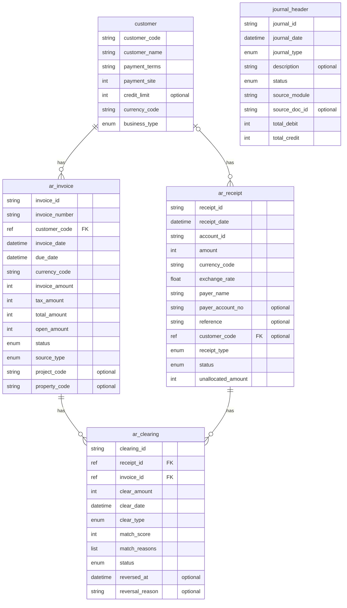
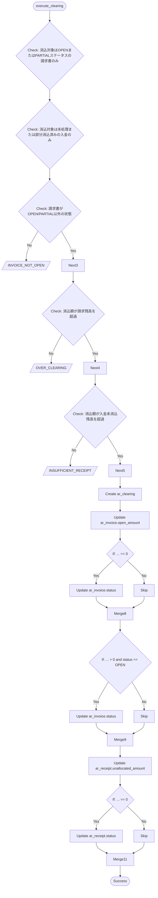
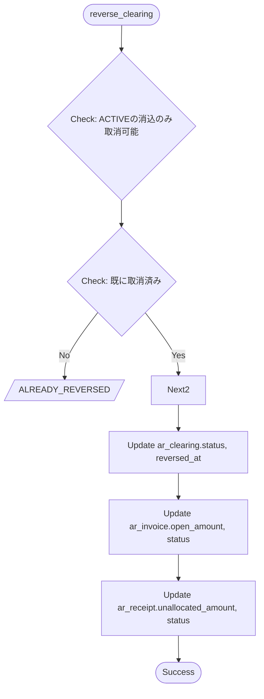
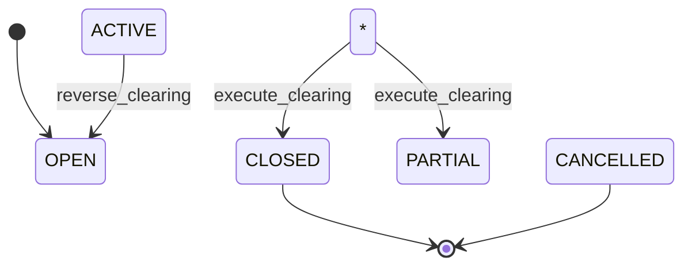
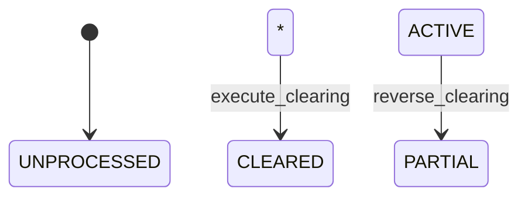
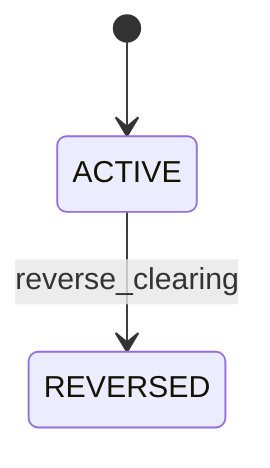
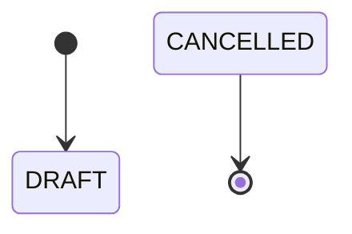

# AR消込システム（上流工程ベース）

*このドキュメントはTRIR仕様から自動生成されました*

---

# 要件定義書

## 概要

**システム名**: AR消込システム（上流工程ベース）
**バージョン**: 1.0.0

## 要件一覧

### REQ-CLR-001: -

**対象者**: 経理部
**目的**: 月次決算を5営業日以内に完了するため
**内容**: 入金消込の自動化率を90%以上にする

### REQ-CLR-002: -

**対象者**: 経理部
**目的**: 未消込滞留を防止するため
**内容**: 30日超の未消込残高を5%以下に維持

### REQ-CLR-003: -

**対象者**: 監査対応
**目的**: 監査証跡を確保するため
**内容**: 全消込処理の履歴を保持

---

# エンティティ一覧

| エンティティ | 説明 | フィールド数 | 関連先 | 関連元 |
|-------------|------|------------|--------|--------|
| customer | 得意先マスタ | 7 | - | ar_invoice, ar_receipt |
| ar_invoice | AR請求書 | 14 | customer | ar_clearing |
| ar_receipt | 入金データ | 13 | customer | ar_clearing |
| ar_clearing | AR消込（請求-入金マッチング） | 11 | ar_receipt, ar_invoice | - |
| journal_header | 仕訳ヘッダ | 9 | - | - |

---

# ER図

---

# フィールド定義

# customer フィールド定義

> 得意先マスタ

| フィールド | 型 | 必須 | 説明 | 参照先 |
|-----------|-----|-----|------|--------|
| customer_code | string | Yes | - | - |
| customer_name | string | Yes | - | - |
| payment_terms | string | Yes | - | - |
| payment_site | int | Yes | - | - |
| credit_limit | int | No | - | - |
| currency_code | string | Yes | - | - |
| business_type | enum(CONSULTING, PROPERTY, SECURITIES, OTHER) | Yes | - | - |

# ar_invoice フィールド定義

> AR請求書

| フィールド | 型 | 必須 | 説明 | 参照先 |
|-----------|-----|-----|------|--------|
| invoice_id | string | Yes | - | - |
| invoice_number | string | Yes | - | - |
| customer_code | ref(customer) | Yes | - | customer |
| invoice_date | datetime | Yes | - | - |
| due_date | datetime | Yes | - | - |
| currency_code | string | Yes | - | - |
| invoice_amount | int | Yes | - | - |
| tax_amount | int | Yes | - | - |
| total_amount | int | Yes | - | - |
| open_amount | int | Yes | - | - |
| status | enum(OPEN, PARTIAL, CLOSED, CANCELLED) | Yes | - | - |
| source_type | enum(MANUAL, PROJECT, RENT, DIVIDEND) | Yes | - | - |
| project_code | string | No | - | - |
| property_code | string | No | - | - |

# ar_receipt フィールド定義

> 入金データ

| フィールド | 型 | 必須 | 説明 | 参照先 |
|-----------|-----|-----|------|--------|
| receipt_id | string | Yes | - | - |
| receipt_date | datetime | Yes | - | - |
| account_id | string | Yes | - | - |
| amount | int | Yes | - | - |
| currency_code | string | Yes | - | - |
| exchange_rate | float | Yes | - | - |
| payer_name | string | Yes | - | - |
| payer_account_no | string | No | - | - |
| reference | string | No | - | - |
| customer_code | ref(customer) | No | - | customer |
| receipt_type | enum(EB_IMPORT, MANUAL, API) | Yes | - | - |
| status | enum(5 values) | Yes | - | - |
| unallocated_amount | int | Yes | - | - |

# ar_clearing フィールド定義

> AR消込（請求-入金マッチング）

| フィールド | 型 | 必須 | 説明 | 参照先 |
|-----------|-----|-----|------|--------|
| clearing_id | string | Yes | - | - |
| receipt_id | ref(ar_receipt) | Yes | - | ar_receipt |
| invoice_id | ref(ar_invoice) | Yes | - | ar_invoice |
| clear_amount | int | Yes | - | - |
| clear_date | datetime | Yes | - | - |
| clear_type | enum(AUTO, MANUAL, PARTIAL, REVERSAL) | Yes | - | - |
| match_score | int | Yes | - | - |
| match_reasons | list(string) | Yes | - | - |
| status | enum(ACTIVE, REVERSED) | Yes | - | - |
| reversed_at | datetime | No | - | - |
| reversal_reason | string | No | - | - |

# journal_header フィールド定義

> 仕訳ヘッダ

| フィールド | 型 | 必須 | 説明 | 参照先 |
|-----------|-----|-----|------|--------|
| journal_id | string | Yes | - | - |
| journal_date | datetime | Yes | - | - |
| journal_type | enum(NORMAL, ADJUSTMENT, CLOSING, REVERSAL) | Yes | - | - |
| description | string | No | - | - |
| status | enum(5 values) | Yes | - | - |
| source_module | string | Yes | - | - |
| source_doc_id | string | No | - | - |
| total_debit | int | Yes | - | - |
| total_credit | int | Yes | - | - |

---

# 計算フィールド定義

## invoice_open_amount

**対象エンティティ**: ar_invoice
**説明**: 請求書の未消込残高（請求額 - 消込済み額）

**計算ロジック**:

self.total_amount - ar_clearingの合計(clear_amount)
  条件: invoice_id = 自身のinvoice_id かつ status = 'ACTIVE'

## receipt_unallocated

**対象エンティティ**: ar_receipt
**説明**: 入金の未消込残高（入金額 - 消込済み額）

**計算ロジック**:

self.amount - ar_clearingの合計(clear_amount)
  条件: receipt_id = 自身のreceipt_id かつ status = 'ACTIVE'

## customer_open_balance

**対象エンティティ**: customer
**説明**: 顧客の売掛金残高（全未消込請求の合計）

**計算ロジック**:

ar_invoiceの合計(open_amount)
  条件: customer_code = 自身のcustomer_code かつ status in '['OPEN', 'PARTIAL']'

## customer_overdue_balance

**対象エンティティ**: customer
**説明**: 顧客の期日超過残高（30日超）

**計算ロジック**:

ar_invoiceの合計(open_amount)
  条件: customer_code = 自身のcustomer_code かつ status in '['OPEN', 'PARTIAL']' かつ ... lt '-30'

## clearing_is_auto_approvable

**対象エンティティ**: ar_clearing
**説明**: 自動承認可能かどうか（確信度90%以上）

**計算ロジック**:

self.match_score >= 90

---

# 機能定義

## execute_clearing

**説明**: 入金を請求書に消込

**入力パラメータ**:

- `receipt_id` (string): 
- `invoice_id` (string): 
- `amount` (int): 
- `match_score` (int): 
- `match_reasons` (list(string)): 
- `clear_type` (string): 

**事前条件**:

- 消込対象はOPENまたはPARTIALステータスの請求書のみ
- 消込対象は未処理または部分消込済みの入金のみ

**エラーケース**:

- `INVOICE_NOT_OPEN`: 請求書がOPEN/PARTIAL以外の状態
- `OVER_CLEARING`: 消込額が請求残高を超過
- `INSUFFICIENT_RECEIPT`: 消込額が入金未消込残高を超過

**実行結果**:

- ar_clearingレコードを作成
- ar_invoiceのopen_amountを更新
- ar_invoiceのstatusを更新 (条件: ... = '0')
- ar_invoiceのstatusを更新 (条件: ... gt '0' かつ status = 'OPEN')
- ar_receiptのunallocated_amountを更新
- ar_receiptのstatusを更新 (条件: ... = '0')

## reverse_clearing

**説明**: 消込の取消

**入力パラメータ**:

- `clearing_id` (string): 
- `reason` (string): 

**事前条件**:

- ACTIVEの消込のみ取消可能

**エラーケース**:

- `ALREADY_REVERSED`: 既に取消済み

**実行結果**:

- ar_clearingのstatus, reversed_at, reversal_reasonを更新
- ar_invoiceのopen_amount, statusを更新
- ar_receiptのunallocated_amount, statusを更新

## フローチャート

### execute_clearing

### reverse_clearing

---

# 状態遷移図

## ar_invoice.status

## ar_receipt.status

## ar_clearing.status

## journal_header.status

---

# テストシナリオ一覧

| ID | タイトル | 対象機能 | 検証要件 | 期待結果 |
|----|---------|---------|---------|---------|
| CLR-001 | 金額完全一致で自動消込成功 | execute_clearing | REQ-CLR-001 | 成功 |
| CLR-002 | 部分入金で残高が減少 | execute_clearing | REQ-CLR-001 | 成功 |
| CLR-003 | 過剰消込はエラー | execute_clearing | REQ-CLR-001 | エラー: OVER_CLEARING |
| CLR-004 | 消込取消で残高復元 | reverse_clearing | REQ-CLR-003 | 成功 |

---

# 不変条件一覧

## INV-001

**対象**: ar_invoice
**説明**: 請求書の残高は常に0以上
**重要度**: error

## INV-002

**対象**: ar_invoice
**説明**: 残高は請求総額を超えない
**重要度**: error

## INV-003

**対象**: ar_receipt
**説明**: 入金の未消込額は常に0以上
**重要度**: error

## INV-004

**対象**: ar_clearing
**説明**: 消込額は常に正の値
**重要度**: error

## INV-005

**対象**: journal_header
**説明**: 仕訳の借方・貸方は必ず一致（貸借バランス）
**重要度**: error
