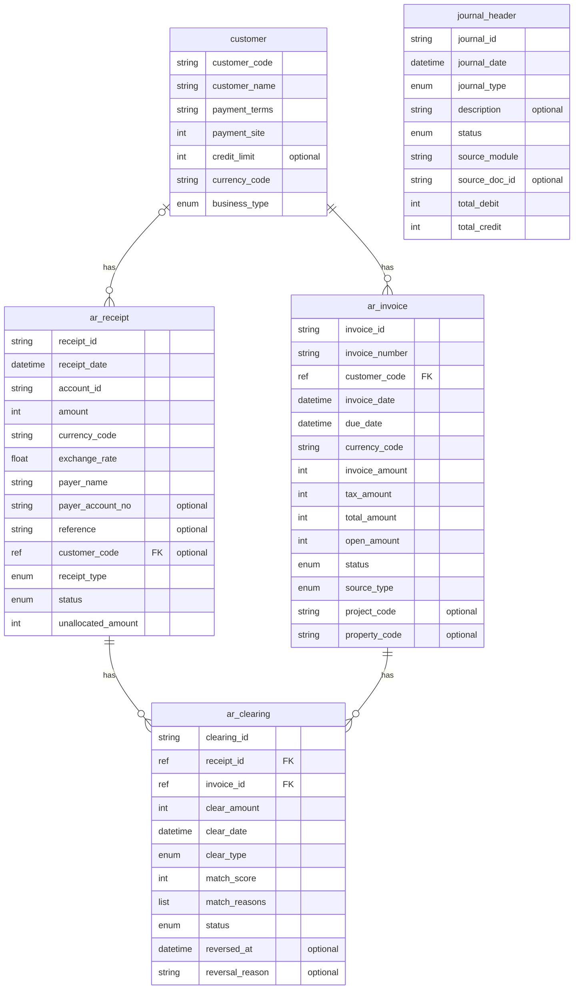

# データモデル（論理ER図）

*このドキュメントはTRIR仕様から自動生成されました*

## ER図

---

# エンティティ一覧

| エンティティ | 説明 | フィールド数 | 関連先 | 関連元 |
|-------------|------|------------|--------|--------|
| customer | 得意先マスタ | 7 | - | ar_invoice, ar_receipt |
| ar_invoice | AR請求書 | 14 | customer | ar_clearing |
| ar_receipt | 入金データ | 13 | customer | ar_clearing |
| ar_clearing | AR消込（請求-入金マッチング） | 11 | ar_receipt, ar_invoice | - |
| journal_header | 仕訳ヘッダ | 9 | - | - |

---

# フィールド定義

# customer フィールド定義

> 得意先マスタ

| フィールド | 型 | 必須 | 説明 | 参照先 |
|-----------|-----|-----|------|--------|
| customer_code | string | Yes | - | - |
| customer_name | string | Yes | - | - |
| payment_terms | string | Yes | - | - |
| payment_site | int | Yes | - | - |
| credit_limit | int | No | - | - |
| currency_code | string | Yes | - | - |
| business_type | enum(CONSULTING, PROPERTY, SECURITIES, OTHER) | Yes | - | - |

# ar_invoice フィールド定義

> AR請求書

| フィールド | 型 | 必須 | 説明 | 参照先 |
|-----------|-----|-----|------|--------|
| invoice_id | string | Yes | - | - |
| invoice_number | string | Yes | - | - |
| customer_code | ref(customer) | Yes | - | customer |
| invoice_date | datetime | Yes | - | - |
| due_date | datetime | Yes | - | - |
| currency_code | string | Yes | - | - |
| invoice_amount | int | Yes | - | - |
| tax_amount | int | Yes | - | - |
| total_amount | int | Yes | - | - |
| open_amount | int | Yes | - | - |
| status | enum(OPEN, PARTIAL, CLOSED, CANCELLED) | Yes | - | - |
| source_type | enum(MANUAL, PROJECT, RENT, DIVIDEND) | Yes | - | - |
| project_code | string | No | - | - |
| property_code | string | No | - | - |

# ar_receipt フィールド定義

> 入金データ

| フィールド | 型 | 必須 | 説明 | 参照先 |
|-----------|-----|-----|------|--------|
| receipt_id | string | Yes | - | - |
| receipt_date | datetime | Yes | - | - |
| account_id | string | Yes | - | - |
| amount | int | Yes | - | - |
| currency_code | string | Yes | - | - |
| exchange_rate | float | Yes | - | - |
| payer_name | string | Yes | - | - |
| payer_account_no | string | No | - | - |
| reference | string | No | - | - |
| customer_code | ref(customer) | No | - | customer |
| receipt_type | enum(EB_IMPORT, MANUAL, API) | Yes | - | - |
| status | enum(5 values) | Yes | - | - |
| unallocated_amount | int | Yes | - | - |

# ar_clearing フィールド定義

> AR消込（請求-入金マッチング）

| フィールド | 型 | 必須 | 説明 | 参照先 |
|-----------|-----|-----|------|--------|
| clearing_id | string | Yes | - | - |
| receipt_id | ref(ar_receipt) | Yes | - | ar_receipt |
| invoice_id | ref(ar_invoice) | Yes | - | ar_invoice |
| clear_amount | int | Yes | - | - |
| clear_date | datetime | Yes | - | - |
| clear_type | enum(AUTO, MANUAL, PARTIAL, REVERSAL) | Yes | - | - |
| match_score | int | Yes | - | - |
| match_reasons | list(string) | Yes | - | - |
| status | enum(ACTIVE, REVERSED) | Yes | - | - |
| reversed_at | datetime | No | - | - |
| reversal_reason | string | No | - | - |

# journal_header フィールド定義

> 仕訳ヘッダ

| フィールド | 型 | 必須 | 説明 | 参照先 |
|-----------|-----|-----|------|--------|
| journal_id | string | Yes | - | - |
| journal_date | datetime | Yes | - | - |
| journal_type | enum(NORMAL, ADJUSTMENT, CLOSING, REVERSAL) | Yes | - | - |
| description | string | No | - | - |
| status | enum(5 values) | Yes | - | - |
| source_module | string | Yes | - | - |
| source_doc_id | string | No | - | - |
| total_debit | int | Yes | - | - |
| total_credit | int | Yes | - | - |

