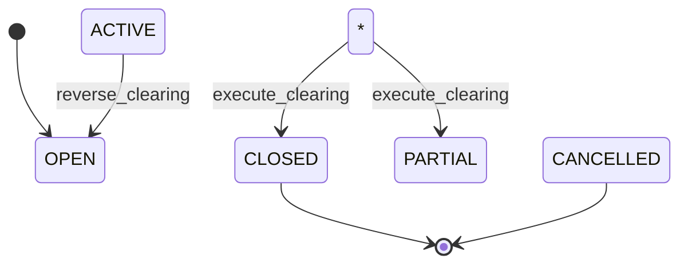
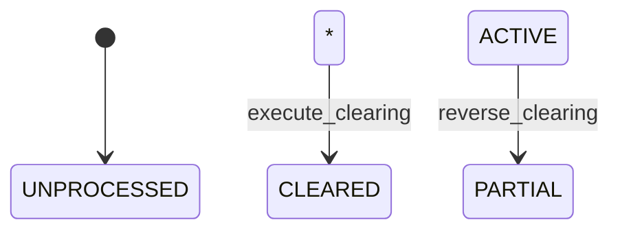
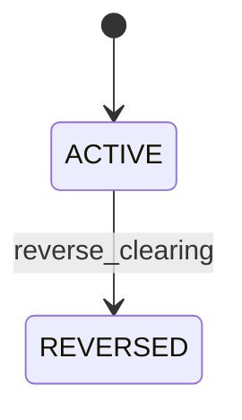
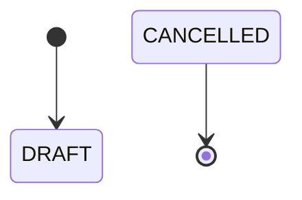

# 状態遷移定義

*このドキュメントはTRIR仕様から自動生成されました*

## ar_invoice.status

```mermaid
stateDiagram-v2
    [*] --> OPEN
    * --> CLOSED : execute_clearing
    * --> PARTIAL : execute_clearing
    ACTIVE --> OPEN : reverse_clearing
    CLOSED --> [*]
    CANCELLED --> [*]
```

## ar_receipt.status

```mermaid
stateDiagram-v2
    [*] --> UNPROCESSED
    * --> CLEARED : execute_clearing
    ACTIVE --> PARTIAL : reverse_clearing
```

## ar_clearing.status

```mermaid
stateDiagram-v2
    [*] --> ACTIVE
    ACTIVE --> REVERSED : reverse_clearing
```

## journal_header.status

```mermaid
stateDiagram-v2
    [*] --> DRAFT
    CANCELLED --> [*]
```

