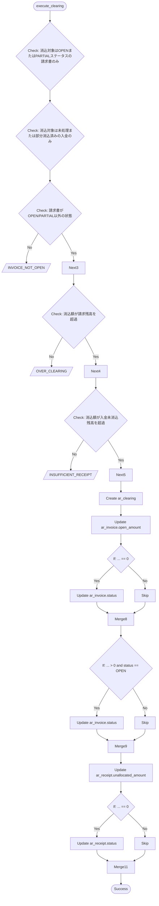
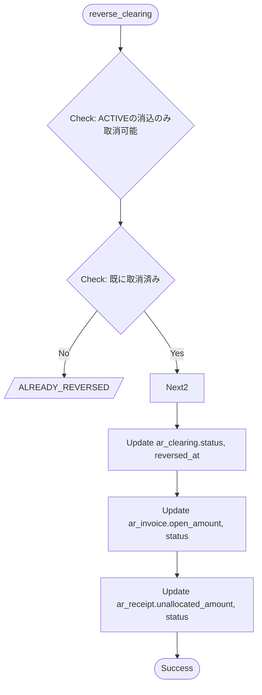

# 消込ロジック設計

*このドキュメントはTRIR仕様から自動生成されました*

# 機能定義

## execute_clearing

**説明**: 入金を請求書に消込

**入力パラメータ**:

- `receipt_id` (string): 
- `invoice_id` (string): 
- `amount` (int): 
- `match_score` (int): 
- `match_reasons` (list(string)): 
- `clear_type` (string): 

**事前条件**:

- 消込対象はOPENまたはPARTIALステータスの請求書のみ
- 消込対象は未処理または部分消込済みの入金のみ

**エラーケース**:

- `INVOICE_NOT_OPEN`: 請求書がOPEN/PARTIAL以外の状態
- `OVER_CLEARING`: 消込額が請求残高を超過
- `INSUFFICIENT_RECEIPT`: 消込額が入金未消込残高を超過

**実行結果**:

- ar_clearingレコードを作成
- ar_invoiceのopen_amountを更新
- ar_invoiceのstatusを更新 (条件: ... = '0')
- ar_invoiceのstatusを更新 (条件: ... gt '0' かつ status = 'OPEN')
- ar_receiptのunallocated_amountを更新
- ar_receiptのstatusを更新 (条件: ... = '0')

## reverse_clearing

**説明**: 消込の取消

**入力パラメータ**:

- `clearing_id` (string): 
- `reason` (string): 

**事前条件**:

- ACTIVEの消込のみ取消可能

**エラーケース**:

- `ALREADY_REVERSED`: 既に取消済み

**実行結果**:

- ar_clearingのstatus, reversed_at, reversal_reasonを更新
- ar_invoiceのopen_amount, statusを更新
- ar_receiptのunallocated_amount, statusを更新

---

# フローチャート

## execute_clearing

## reverse_clearing

